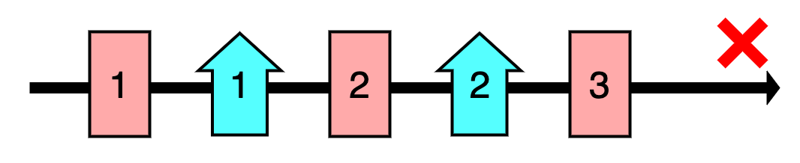
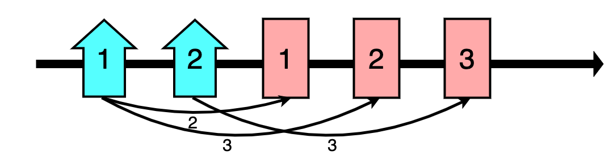
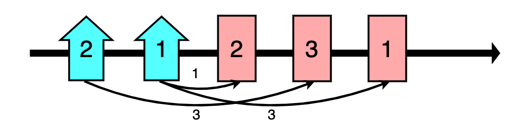

# 건물 배치하기

n명의 주민들이 살 아파트 a개와 통근할 회사 b개의 위치를 정하여, 주민들의 통근 거리의 합을 최소화하려 합니다.

아파트에는 1번부터 a번까지, 회사에는 1번부터 b번까지 번호가 붙어 있습니다. 또한 건물을 지을 위치는 수직선 상의 1부터 a+b까지의 정수점으로 나타낼 수 있습니다. 이때 아파트는 1부터 a까지의 위치에, 회사는 a+1부터 a+b까지의 위치에 배치해야 합니다. 즉, 아파트는 왼쪽 a개의 위치에, 회사는 오른쪽 b개의 위치에 배치해야 합니다.

예를 들어 a = 2, b = 3이고, 3명의 주민이 살 아파트의 번호와 통근할 회사의 번호가 아래 표와 같다고 해봅시다.

<table>
  <thead>
    <tr>
      <th>주민</th>
      <th>아파트 번호</th>
      <th>회사 번호</th>
    </tr>
  </thead>
  <tbody>
    <tr>
      <td>#1</td>
      <td>1</td>
      <td>1</td>
    </tr>
    <tr>
      <td>#2</td>
      <td>1</td>
      <td>2</td>
    </tr>
    <tr>
      <td>#3</td>
      <td>2</td>
      <td>3</td>
    </tr>
  </tbody>
</table>

아파트는 왼쪽 2개의 위치에, 회사는 오른쪽 3개의 위치에 배치해야 합니다. 따라서 다음과 같이 건물을 왼쪽부터 1번 회사, 1번 아파트, 2번 회사, 2번 아파트, 3번 회사 순서로 배치하는 것은 불가능합니다.

 

 

다음과 같이 건물을 왼쪽부터 1번 아파트, 2번 아파트, 1번 회사, 2번 회사, 3번 회사 순서로 배치하면 주민들의 통근 거리의 합은 2 + 3 + 3 = 8입니다.

 

 

반면 다음과 같이 건물을 왼쪽부터 2번 아파트, 1번 아파트, 2번 회사, 3번 회사, 1번 회사 순서로 배치하면 주민들의 통근 거리의 합은 3 + 1 + 3 = 7입니다.

 

 

주민들의 통근 거리의 합을 7보다 작게 하는 방법은 없습니다.

아파트의 개수를 나타내는 정수 a, 회사의 개수를 나타내는 정수 b, 주민들이 살 아파트와 통근할 회사의 번호가 담긴 2차원 정수 배열 infos가 매개변수로 주어집니다. 아파트와 회사를 조건에 맞게 배치할 때 주민들의 통근 거리의 합의 최솟값을 return 하도록 함수를 완성해 주세요.

## 제한사항

- 1 ≤ a ≤ 100,000
- 1 ≤ b ≤ 100,000
- 1 ≤ infos의 길이 = n ≤ 100,000
  - `infos[i]`는 `[num1, num2]` 형태의 길이가 2인 1차원 정수 배열입니다.
  - i+1번째 주민이 num1번 아파트에 거주하고 num2번 회사로 출근함을 의미합니다.
  - 1 ≤ num1 ≤ a
  - 1 ≤ num2 ≤ b

## 입출력 예

<table>
  <thead>
    <tr>
      <th>a</th>
      <th>b</th>
      <th>infos</th>
      <th>result</th>
    </tr>
  </thead>
  <tbody>
    <tr>
      <td>2</td>
      <td>3</td>
      <td>[[1, 1], [1, 2], [2, 3]]</td>
      <td>7</td>
    </tr>
    <tr>
      <td>5</td>
      <td>5</td>
      <td>[[3, 1], [2, 5], [3, 2], [1, 2], [1, 2], [4, 3]]</td>
      <td>19</td>
    </tr>
  </tbody>
</table>

## 입출력 예 설명

### 입출력 예 #1

문제의 예시와 같습니다.

### 입출력 예 #2

주민이 살지 않는 아파트와 통근하는 사람이 없는 회사가 있을 수 있음에 유의합니다.
