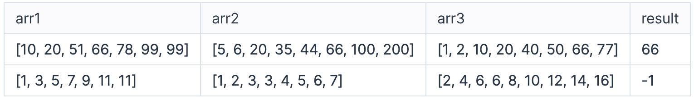

# 공통 원소 찾기

오름차순으로 정렬된 3개의 정수형 배열 arr1, arr2, arr3이 매개변수로 주어집니다. 3개의 배열이 모두 포함하고 있는 공통의 원소를 찾아서 return 하도록 함수를 완성해주세요. 공통의 원소가 여러 개라면 그 중에서 가장 큰 원소를 return 하고, 공통의 원소가 한 개도 없다면 -1을 return 합니다.

## 제한사항

- arr1, arr2, arr3는 길이가 1이상 300,000 이하인 1차원 배열입니다.
- arr1, arr2, arr3의 길이는 각각 다를 수 있습니다.
- arr1, arr2, arr3를 구성하는 원소는 모두 1이상 2,000,000,000 이하인 자연수입니다.

## 입출력 예

 

 

### 입출력 예 설명

< 입출력 예 #1 >

arr1, arr2, arr3이 공통으로 포함하고 있는 원소는 20과 66입니다. 더 큰 숫자인 66을 return 합니다.

 

< 입출력 예 #2 >

arr1, arr2, arr3이 공통으로 포함하고 있는 원소가 한 개도 없으므로, -1을 return 합니다.
