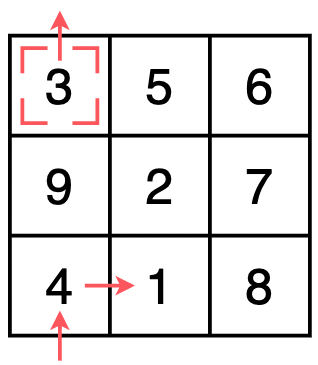
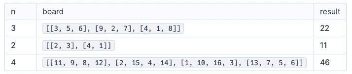

# 숫자 지우기

1부터 n2 까지 순서대로 숫자를 지우는 게임이 있습니다. 게임 보드는 가로, 세로 길이가 n으로 같은 정사각 격자 형태이며, 각 칸에는 1부터 n2 까지의 숫자가 하나씩 쓰여 있습니다. 상하좌우로 1칸씩 커서를 이동하여 숫자를 선택하고, 엔터키로 숫자를 지울 수 있습니다. 게임의 완료 조건은 모든 숫자가 지워지는 것으로, 당신은 게임을 가능한 한 빨리 완료하기 위해 커서의 이동 횟수를 최소화하려고 합니다.

아래 그림은 n이 3인 게임 보드를 나타냅니다.

 

 

게임이 시작되면 커서는 보드의 가장 왼쪽 위에 위치합니다. 커서는 상하좌우로 한 칸씩 움직일 수 있으며, 이때 이동키를 한 번 눌러야 합니다. 보드는 위아래와 좌우가 연결되어 있어서 커서가 가장 왼쪽 열에 있을 때 한번 더 왼쪽으로 가면 해당 행의 제일 오른쪽 열로 이동하며, 그 반대도 가능합니다. 위아래도 마찬가지로, 커서가 가장 위쪽 행에 있을 때 한번 더 위쪽으로 가면 해당 열의 제일 아래쪽 행으로 이동하며 그 반대도 가능합니다.

예를 들어, 위 그림과 같이 커서가 숫자 3에 있을 때 숫자 1을 지우기 위해 키를 최소 3번 이상 눌러야 합니다. 초기 커서 위치에서 `위쪽 → 오른쪽` 키를 눌러 2번 만에 숫자 1로 이동한 뒤 `엔터`키를 눌러 숫자 1을 지울 수 있습니다.

게임 보드 한 변의 길이 n과, 보드 내의 숫자를 나타내는 2차원 배열 board가 매개변수로 주어집니다. 게임을 완료하기 위해 키를 눌러야 하는 최소 횟수를 return 하도록 함수를 완성해주세요.

## 제한사항

- n은 2 이상 30 이하인 자연수입니다.
- board의 행과 열의 길이는 n으로 같습니다.
- board의 원소는 1 이상 n2 이하인 자연수이며 중복이 존재하지 않습니다.

## 입출력 예

 

 

## 입출력 예 설명

### 입출력 예 #1

문제 예시와 같은 보드입니다. 다음 과정을 통해 모든 숫자를 지울 수 있습니다.

> 1 지우기: 위쪽 → 오른쪽 → 엔터
>
> 2 지우기: 위쪽 → 엔터
>
> 3 지우기: 위쪽 → 왼쪽 → 엔터
>
> 4 지우기: 위쪽 → 엔터
>
> 5 지우기: 오른쪽 → 아래쪽 → 엔터
>
> 6 지우기: 오른쪽 → 엔터
>
> 7 지우기: 아래쪽 → 엔터
>
> 8 지우기: 아래 → 엔터
>
> 9 지우기: 위 → 오른쪽 → 엔터

키를 22번 누르면 모든 숫자를 지울 수 있으며 이것이 최소 횟수입니다. 따라서 22를 return 해야 합니다.

### 입출력 예 #2

다음 과정을 통해 모든 숫자를 지울 수 있습니다.

> 1 지우기: 오른쪽 → 아래쪽 → 엔터
>
> 2 지우기: 위쪽 → 왼쪽 → 엔터
>
> 3 지우기: 오른쪽 → 엔터
>
> 4 지우기: 왼쪽 → 아래쪽 → 엔터

키를 11번 누르면 모든 숫자를 지울 수 있으며 이것이 최소 횟수입니다. 따라서 11를 return 해야 합니다.

### 입출력 예 #3

설명 생략
