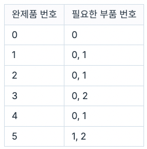
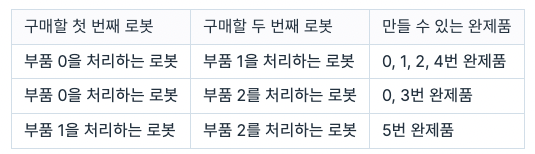
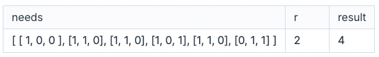

# 공장

로봇을 이용하여 여러 종류의 완제품을 만드는 공장을 운영하려고 합니다. 로봇 한 대는 부품 한 종류만 처리할 수 있으며, 완제품의 종류에 따라 필요한 부품이 다를 수 있습니다. 이때, 로봇 r대로 최대한 다양한 완제품을 만들려 합니다.

예를 들어, 각 완제품을 만들 때 다음과 같은 부품이 필요하고, 살 수 있는 로봇은 최대 두 대라고 가정하겠습니다(번호는 0번부터 시작합니다).

 

 

두 로봇을 이용해 완제품을 만드는 경우는 모두 다음과 같습니다.

 

 

따라서, 최대한 다양한 완제품을 만들려면 부품 0을 처리하는 로봇과 부품 1을 처리하는 로봇을 구매해야 합니다.

완제품을 만드는 데 필요한 부품의 정보 needs와 최대로 구매 가능한 로봇 수 r이 매개변수로 주어질 때, 최대 몇 종류의 완제품을 만들 수 있는지 return 하도록 함수를 완성해 주세요.

## 제한사항

- needs의 세로(행) 길이는 1 이상 1,000 이하입니다.
  - 세로(행) 길이는 만들 수 있는 완제품의 개수를 나타냅니다.
  - 행 번호는 완제품의 번호를 의미하며, 0번부터 시작합니다(0행 → 0번 완제품, 1행 → 1번 완제품 ...).
- needs의 가로(열) 길이는 1 이상 15 이하입니다.
  - 열 번호는 부품 번호를 의미하며, 0번부터 시작합니다.
  - needs의 모든 원소는 0 또는 1 입니다.
  - `needs[x][y]` 값이 1이면 x번 물건을 만드는데 y번 부품이 필요하다 의미입니다.
  - `needs[x][y]` 값이 0이면 x번 물건을 만드는데 y번 부품이 필요 없다는 의미입니다.
  - 번호가 가로(열) 길이 이상인 부품은 모두 필요 없는 것으로 가정하면 됩니다.
  - 예를 들어, 가로(열) 길이가 3인 경우 0번 ~ 2번 부품에 대한 정보가 주어지며, 3보다 큰 번호의 부품은 모두 필요 없는 것으로 가정하면 됩니다.
- r은 1 이상 needs의 가로(열) 길이 이하인 자연수입니다.

## 입출력 예

 

 

## 입출력 예 설명

### 입출력 예 #1

앞서 설명한 예시와 같습니다.
