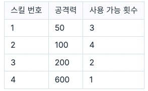
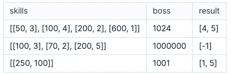

# 다양한 게임 스킬 사용하기

게임을 매우 잘하는 당신은 플레이를 구경하고 있는 친구들에게 멋진 모습을 보여주려고 합니다. 최대한 다양한 스킬을 사용하면서 스킬 사용 횟수를 최소로 하여 보스 몬스터를 처치하려고 합니다.

보스 몬스터에게 데미지를 줄 수 있는 방법은 스킬을 쓰는 것입니다. 당신은 여러 가지 스킬을 쓸 수 있고, 각 스킬마다 보스에게 줄 수 있는 데미지가 다를 수 있으며 최대 사용 횟수가 정해져 있습니다. 보스 몬스터는 맞은 스킬의 공격력만큼 체력이 깎이며, 체력이 0 이하가 되면 쓰러집니다.

아래는 사용할 수 있는 스킬의 공격력과 사용 가능 횟수를 나타내는 예시입니다.

 

 

보스 몬스터의 체력이 1024라면, 스킬 4번을 1회, 스킬 3번을 2회, 스킬 2번을 1회 사용하면 스킬 사용 4회 만에 보스 몬스터를 쓰러뜨릴 수 있습니다. 이때 사용한 스킬의 종류는 3개입니다.

대신에, 스킬 1번을 1회, 스킬 2번을 2회, 스킬 3번을 1회, 스킬 4번을 1회 사용하면 스킬 사용 5회 만에 보스 몬스터를 쓰러뜨릴 수 있고, 이때 사용한 스킬의 종류는 4개입니다. 이와 같이 스킬을 사용하면 최대한 많은 종류의 스킬을 사용하면서 최소 횟수로 보스 몬스터를 쓰러뜨릴 수 있습니다.

스킬의 공격력과 사용 가능 횟수를 담은 2차원 정수 배열 skills와, 보스 몬스터의 체력을 나타내는 정수 boss가 매개변수로 주어집니다. 최대한 많은 종류의 스킬을 사용하는 경우 중에 스킬 사용 횟수를 최소로 하는 방법을 찾아, 이때 사용한 스킬의 종류 수와 사용 횟수를 차례대로 배열에 담아 return 하도록 함수를 완성해주세요. 단, 어떤 방법으로도 보스 몬스터를 쓰러뜨릴 수 없는 경우, -1을 배열에 담아 return 해주세요.

## 제한사항

- 1 ≤ skills의 길이 ≤ 100
- skills의 원소는 [a, b] 형식입니다.
  - a는 스킬의 공격력을 나타냅니다.
  - 1 ≤ a ≤ 1,000
  - a는 중복되지 않습니다.
  - b는 스킬의 사용 가능 횟수를 나타냅니다.
  - 1 ≤ b ≤ 100
- 1 ≤ boss ≤ 10,000,000

## 입출력 예

 

 

## 입출력 예 설명

### 입출력 예 #1

문제 예시와 같습니다.

### 입출력 예 #2

주어진 스킬을 전부 사용해도 보스 몬스터의 체력을 0 이하로 만들 수 없습니다. 따라서 [-1]을 return 합니다.

### 입출력 예 #3

사용할 수 있는 스킬이 한 종류이고, 이 스킬을 5번 사용해야 보스 몬스터를 쓰러뜨릴 수 있습니다. 따라서 [1, 5]를 return 합니다.
