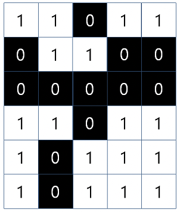

# 이미지 영역 판정

R x C 크기의 흑백 이미지가 있습니다. 1 x 1 크기의 각 칸은 한 개의 픽셀을 나타내며, 검은색 또는 흰색으로 이루어져 있고, 검은색 부분은 0, 흰색 부분은 1로 표현됩니다. 이때, 우리는 흰색으로만 이루어진 영역이 몇 개인지 찾으려고 합니다. 영역이란, 픽셀들이 가로 또는 세로로 서로 연결되어 있을 때 1개의 영역이라고 하며, 픽셀의 개수가 그 영역의 넓이가 됩니다. **단, 대각선으로 연결된 것은 같은 영역이 아닙니다.**

예를 들면, 6 x 5 크기의 이미지가

 

 

위와 같이 주어질때, 흰색 영역은 4개이며, 가장 큰 넓이는 8이 됩니다.

흑백 이미지가 매개변수 v로 주어질 때, 흰색 영역의 개수와 흰색 영역 중에서 가장 큰 넓이를 return 하도록 함수를 완성해 주세요. 단, 영역의 개수와 넓이 순으로 return 해주세요. 위의 예시의 경우, [4, 8]을 return 하면 됩니다.

## 제한사항

- 흑백 이미지 v는 2차원 배열로 주어지며, 0 또는 1로만 이루어져 있습니다.
- v는 R x C 크기의 2차원 배열입니다.
  - R, C: 50 이하의 자연수

## 입출력 예

<table>
  <thead>
    <tr>
      <th>v</th>
      <th>answer</th>
    </tr>
  </thead>
  <tbody>
    <tr>
      <td>[[1,1,0,1,1], [0,1,1,0,0], [0,0,0,0,0], [1,1,0,1,1], [1,0,1,1,1], [1,0,1,1,1]]</td>
      <td>[4,8]</td>
    </tr>
  </tbody>
</table>

## 입출력 예 설명

### 입출력 예 #1

문제의 예시와 같습니다.
