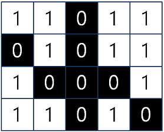
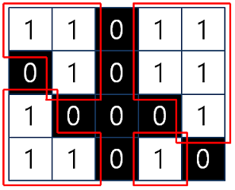
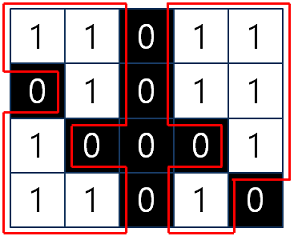
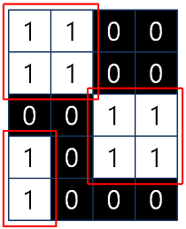
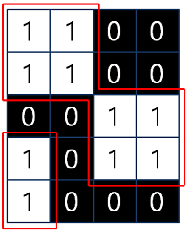

# 이미지 영역 판정 2

R x C 크기의 흑백 이미지가 있습니다. 1 x 1 크기의 각 칸은 한 개의 픽셀을 나타내며, 검은색 또는 흰색으로 이루어져 있고, 검은색 부분은 0, 흰색 부분은 1로 표현됩니다. 이때, 우리는 흰색으로만 이루어진 영역이 몇 개인지 찾으려고 합니다. 영역이란, 픽셀들이 서로 연결되어 있을 때 1개의 영역이라고 합니다. 단, 영역을 판정할 때는 2가지 관점으로 나눠서 영역을 판정하려고 합니다.

- 첫 번째 관점은 픽셀들이 가로 또는 세로로 서로 연결되어 있을 때 1개의 영역이라고 합니다.
- 두 번째 관점은 픽셀들이 가로, 세로 또는 대각선으로 서로 연결되어 있을 때 1개의 영역이라고 합니다.

예를 들면, 4 x 5 크기의 이미지가

 

 

로 주어질 때,

- 첫 번째 관점에서 흰색 영역은 4개입니다.

 

 

두 번째 관점에서 흰색 영역은 2개입니다.

 

 

흑백 이미지가 매개변수 image로 주어질 때, 각 관점에서 판정한 영역의 개수를 return 하도록 함수를 완성해 주세요. 단, 첫 번째 관점과 두 번째 관점 순으로 return 해주세요. 위의 예시의 경우, 1차원 배열 [4,2]을 return 하면 됩니다.

## 제한사항

- 흑백 이미지 image는 2차원 배열로 주어지며, 0 또는 1로만 이루어져 있습니다.
- R , C : 50 이하의 자연수

## 입출력 예

<table>
  <thead>
    <tr>
      <th>image</th>
      <th>answer</th>
    </tr>
  </thead>
  <tbody>
    <tr>
      <td>[[1,1,0,1,1],[0,1,0,1,1],[1,0,0,0,1],[1,1,0,1,0]]	</td>
      <td>[4, 2]</td>
    </tr>
    <tr>
      <td>[[1,1,0,0],[1,1,0,0],[0,0,1,1],[1,0,1,1],[1,0,0,0]]</td>
      <td>[3, 2]</td>
    </tr>
  </tbody>
</table>

## 입출력 예 설명

### 입출력 예 #1

문제의 예시와 같습니다.

### 입출력 예 #2

첫 번째 관점에서 흰색 영역은 3개입니다.

 

 

두 번째 관점에서 흰색 영역은 2개입니다.

 

 
