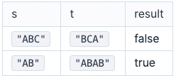

# '무한히' 같은 문자열

두 개의 문자열이 있습니다. 이 두 개의 문자열을 각각 무한히 반복했을 때 서로 같아진다면 두 문자열을 '무한히 같다'라고 표현합니다.

예를 들어,

- "ABC" 와 "BCA"를 무한히 반복하더라도 둘은 다른 문자열입니다.
- "AB"와 "ABAB"는 문자열을 무한히 적으면 "ABABABABABAB…."로 같아지기 때문에 무한히 같은 문자열입니다.

s와 t 두 개의 문자열이 주어질 때, 무한히 같은 문자열이면 true를, 그렇지 않으면 false를 반환하도록 함수를 완성하세요.

## 제한사항

문자열 s와 t의 길이는 10,000 보다 작거나 같은 자연수입니다.

## 입출력 예

 

 

## 입출력 예 설명

### 입출력 예 #1

ABC를 무한히 반복하면 ABCABCABC...가 되며 BCA를 무한히 반복하면 BCABCABCA...가 되어 서로 다른 문자열이 됩니다.

### 입출력 예 #2

AB를 무한히 반복하면 ABABABAB...가 되며 ABAB를 무한히 반복해도 ABABABAB...가 되기 때문에 무한히 같은 문자열입니다.
