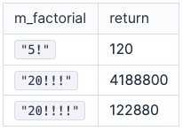

# 멀티 팩토리얼

팩토리얼(factorial)은 그 수보다 작거나 같은 모든 양의 정수의 곱을 의미합니다. 기호는 느낌표인 '!'를 사용합니다.

- 5! = 5×4×3×2×1

멀티 팩토리얼은 그 수보다 '!' 개수의 배수만큼 작거나 같은 모든 양의 정수의 곱을 의미합니다.

- 20!!!! = 20×(20-4)×(20-8)×(20-12)×(20-16)

멀티 팩토리얼 수 m_factorial이 매개변수로 주어질 때, 수의 값을 return 하도록 함수를 완성해주세요.

## 제한사항

- m_factorial은 문자열 형태이며, 숫자와 '!' 로만 구성되어 있습니다.
  - 숫자 부분은 1 이상 20 이하입니다.
  - '!' 개수는 1개 이상 5개 이하입니다.
  - 항상 올바른 식이 입력으로 주어지며, 숫자는 0으로 시작하지 않습니다.
- 정답이 231 - 1 이하인 경우만 입력으로 주어집니다.

## 입출력 예

 

 

## 입출력 예 설명

### 입출력 예 #1

5! = 5 x 4 x 3 x 2 x 1 = 120

### 입출력 예 #2

20!!! = 20 × 17 × 14 × 11 × 8 × 5 × 2 = 4,188,800

### 입출력 예 #3

20!!!! = 20 × 16 x 12 x 8 x 4 = 122,880
