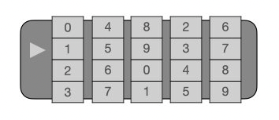
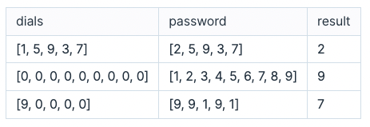
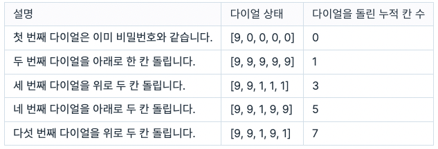

# 금고 열기

당신의 방엔 오래된 금고 하나가 있습니다. 이 금고는 n개의 숫자 다이얼을 돌려 잠금장치에 설정된 비밀번호를 입력하면 문이 열리는 구조입니다.

 

 

위 그림은 다이얼의 개수가 5인 잠금장치입니다. 숫자 다이얼은 0부터 9까지 10개의 수가 차례대로 이어진 원형 구조로, 다이얼을 아래로 돌리면 수가 감소하고 위로 돌리면 수가 증가합니다. 예를 들어 다이얼이 9를 가리킬 때 한 칸 아래로 돌리면 8이 되고 한 칸 위로 돌리면 0이 됩니다.

단, 이 금고에는 특이한 장치가 설치되어 다이얼을 돌리면 그 다이얼의 오른쪽에 있는 다이얼들이 함께 돌아갑니다.

예를 들어, 다이얼이 현재 [1, 5, 9, 3, 7]을 가리키고 있고 설정된 비밀번호는 [2, 5, 9, 3, 7]이라고 하겠습니다.
첫 번째 다이얼을 위로 한 칸 돌리면 모든 다이얼이 같이 움직여 번호는 [2, 6, 0, 4, 8]이 됩니다.
두 번째 다이얼을 아래로 한 칸 돌리면 2 ~ 5번째 다이얼이 같이 움직여 번호는 [2, 5, 9, 3, 7]이 됩니다. 다이얼을 두 칸 돌려서 비밀번호를 맞췄습니다.

당신은 금고의 비밀번호를 맞추기 위해 다이얼을 최소 몇 칸 돌려야 하는지를 알고 싶습니다.

다이얼들의 초기 상태를 순서대로 담아낸 1차원 정수 배열 dials와 금고의 비밀번호를 다이얼 순서대로 담아낸 1차원 정수 배열 password가 매개변수로 주어집니다. 이때, 비밀번호를 맞추기 위해 다이얼을 돌려야 하는 최소 칸 수를 return 하도록 함수를 완성해주세요.

## 제한사항

- 1 ≤ dials의 길이 = password의 길이 ≤ 100,000
  - 0 ≤ `dials[i]`, `password[i]` ≤ 9
  - `dials[i]`는 i + 1번째 다이얼이 처음에 가리키는 숫자입니다.
  - `password[i]`는 비밀번호의 i + 1번째 숫자입니다.

## 입출력 예

 

 

## 입출력 예 설명

### 입출력 예 #1

문제의 설명과 같습니다.

### 입출력 예 #2

9개의 다이얼을 각각 위로 한 칸씩 돌리면 비밀번호를 맞출 수 있습니다. 더 적은 칸수로 다이얼을 돌려 비밀번호를 맞추는 방법은 없습니다.

따라서 9를 return 합니다.

### 입출력 예 #3

 

 

따라서 7을 return 합니다.
