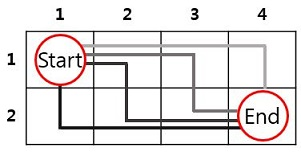

# 격자 위의 경로

r x c 크기의 격자가 있습니다. 각 격자 칸에서는 오른쪽, 또는 아래 방향으로 1칸씩 이동 가능합니다. 다음은 r = 2, c = 4인 격자의 가장 왼쪽 위인 (1, 1)에서 시작하여 가장 오른쪽 아래인 (2, 4)로 이동하는 방법을 나타낸 그림입니다.

 

 

위 그림과 같이 2 x 4크기의 격자에서 이동하는 방법은 4가지가 있습니다. 격자의 행의 길이 r과 열의 길이 c이 매개변수로 주어질 때, 가장 왼쪽 위에서 가장 오른쪽 아래로 이동하는 방법의 수를 구하여 return하는 함수를 완성해 주세요.

## 제한사항

- r, c는 정수입니다.
- 1 ≤ r, c ≤ 20
- r + c ≤ 40

## 입출력 예

<table>
  <thead>
    <tr>
      <th>r</th>
      <th>c</th>
      <th>answer</th>
    </tr>
  </thead>
  <tbody>
    <tr>
      <td>2</td>
      <td>4</td>
      <td>4</td>
    </tr>
    <tr>
      <td>3</td>
      <td>3</td>
      <td>6</td>
    </tr>
  </tbody>
</table>

## 입출력 예 설명

### 입출력 예 #1

2 x 4 크기의 격자에서 이동 가능한 방법은 위 그림과 같이 4가지 입니다.

### 입출력 예 #2

3 x 3 크기의 격자에서 이동 가능한 방법은 6가지 입니다.
