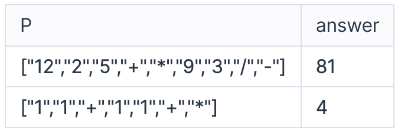

# Postfix Expression

우리는 Postfix expression으로 표현된 식을 계산하려고 합니다. Postfix expression은 후위 표기법으로 표현된 식입니다. 후위 표기법은 수식을 표현할 때 피연산자(operand) 다음에 연산자(operator)를 표기하는 표현 방식입니다.

주어진 Postfix expression은 string 배열로 표현되었으며, 각 배열 원소는 string 형으로 표현된 연산자와 피연산자로 이루어져 있습니다. 연산자는 `"+"`, `"-"`, `"/"`, `"＊"` 이며, 피연산자는 100,000이하의 자연수입니다.

예를 들어, 주어진 Postfix expression로 표현된 식 P = `[ "12", "2", "5", "+", "*", "9", "3", "/", "-" ]` 로 주어진다면 계산 과정은 다음과 같습니다.

1. 2 + 5 = 7
2. 12 \* 7 = 84
3. 9 / 3 = 3
4. 84 - 3 = 81
5. 즉, 계산한 결과는 81입니다.

Postfix expression이 매개변수 P로 주어졌을 때, 이를 계산한 결과를 return 하는 함수를 완성해 주세요. 위의 예시의 경우에는 81를 return 하면 됩니다. 단, return 할 때는 숫자형으로 반환해 주세요. 주어진 식에서 나눗셈은 항상 나누어떨어지는 경우만 주어집니다.

## 제한사항

- 식 P는 string 배열이며, 각 배열 원소는 string형으로 표현된 연산자 또는 피연산자로 이루어져 있습니다.
- 피연산자는 100,000 이하의 자연수이며, 연산자는 `"+"`, `"-"`, `"/"`, `"＊"` 로만 이루어져 있습니다.
- 식 P의 길이는 100,000 이하의 자연수입니다.
- 식의 모순은 없으므로 항상 계산이 가능합니다.

## 입출력 예

 

 

### 입출력 예 설명

< 입출력 예 #1 >

- 문제의 예시와 같습니다.

 

< 입출력 예 #2 >

계산 과정은 다음과 같습니다.

1. 1 + 1 = 2
2. 1 + 1 = 2
3. 2 \* 2 = 4

즉, 계산한 결과는 4이므로 4를 return 하면 됩니다.
