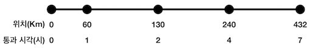
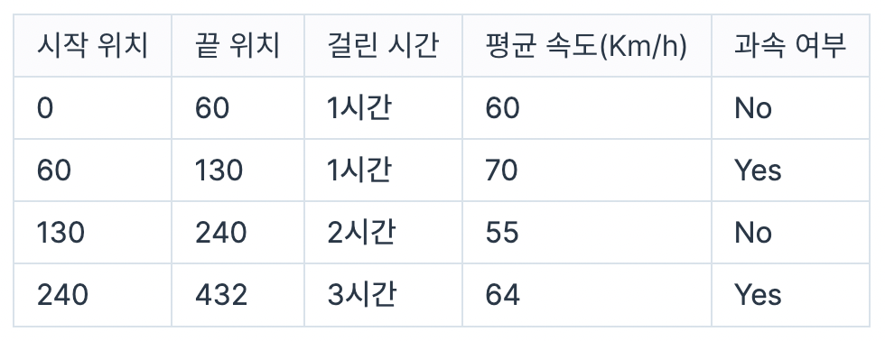
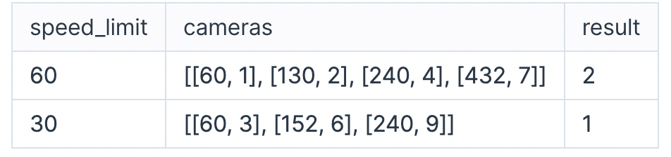

# 속도 위반

다음과 같은 방법으로 자동차 과속 단속을 하려 합니다.

- 자동차가 카메라 설치 지점을 지난 순간의 시각을 기록합니다.
- 바로 이전 지점을 지난 시각을 이용해 평균 속도를 계산합니다.
- 평균 속도가 제한속도보다 크면 해당 구간에서 과속했다고 기록합니다.
  - 제한속도는 speed_limit만큼이며, 전체 구간에 동일하게 적용됩니다.

단, 서로 인접한 두 카메라 사이를 지나는 평균 속도만 단속에 활용합니다. (0Km 지점에 카메라 있음)

다음은 카메라가 설치된 위치와, 해당 위치를 자동차가 통과한 시각을 나타낸 예시입니다.

 

 

자동차는 0Km 지점에서 출발하며, 자동차가 출발할 때의 시각은 0입니다. 제한 속도가 시속 60Km일 때, 과속 여부는 다음과 같습니다.

 

 

따라서 총 두 번 과속했습니다.

모든 구간의 제한속도 speed_​​limit, 카메라 설치 지점과 해당 지점을 자동차가 통과한 시각이 들어있는 배열 cameras가 매개변수로 주어질 때, 자동차가 총 몇 번 과속했는지 return 하도록 함수를 완성해주세요.

## 제한사항

- speed_limit은 30 이상 200 이하인 자연수입니다.
- cameras의 길이는 1 이상 20 이하입니다.
- cameras의 원소는 순서대로 [a, b]입니다.
  - a는 1 이상 20,000 이하인 자연수이며 카메라 위치를 나타냅니다.
  - b는 1 이상 100 이하인 자연수이며 자동차 통과 시각을 나타냅니다.
- 카메라 위치가 서로 겹치는 경우는 없으며, 증가하는 순서로 주어집니다.
- 자동차가 통과한 시각이 동일한 경우는 없으며, 증가하는 순서로 주어집니다.

## 입출력 예

 

 

### 입출력 예 설명

< 입출력 예 #1 >

- 문제의 예시와 같습니다.

 

< 입출력 예 #2 >

- 두 번째 구간에서 과속했으므로 1을 return 합니다.
