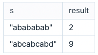

# 문자열의 최소 주기

문자열에서 일정한 간격으로 같은 문자열이 반복해서 나타난다면 이를 문자열의 주기라고 합니다. 예를 들어 문자열 "abababab"에서 문자열의 주기는 다음과 같이 세 가지가 있습니다.

1. 문자열 "ab"가 네 번 반복해서 나타납니다.
2. 문자열 "abab"가 두 번 반복해서 나타납니다.
3. 문자열 "abababab"가 한 번 반복해서 나타납니다.

이때, 가능한 짧은 주기를 문자열의 주기로 정합니다. 따라서 위 문자열의 주기는 2가 됩니다.

문자열 s가 매개변수로 주어질 때, 문자열의 주기를 return 하도록 함수를 완성해주세요.

## 제한사항

- s는 알파벳 소문자로만 이루어진 문자열입니다.
- s의 길이는 1 이상 1,000,000 이하입니다.

## 입출력 예

 

 

## 입출력 예 설명

### 입출력 예 #1

문제의 예시와 같습니다.

### 입출력 예 #2

"abc"가 s[3]~ s[5]에서 한번 반복해서 나타나지만, s[6]~s[8]에서는 나타나지 않으므로 가장 짧은 주기는 전체 문자열의 길이인 9가 됩니다.
